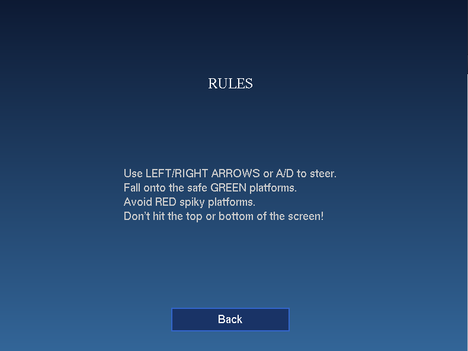
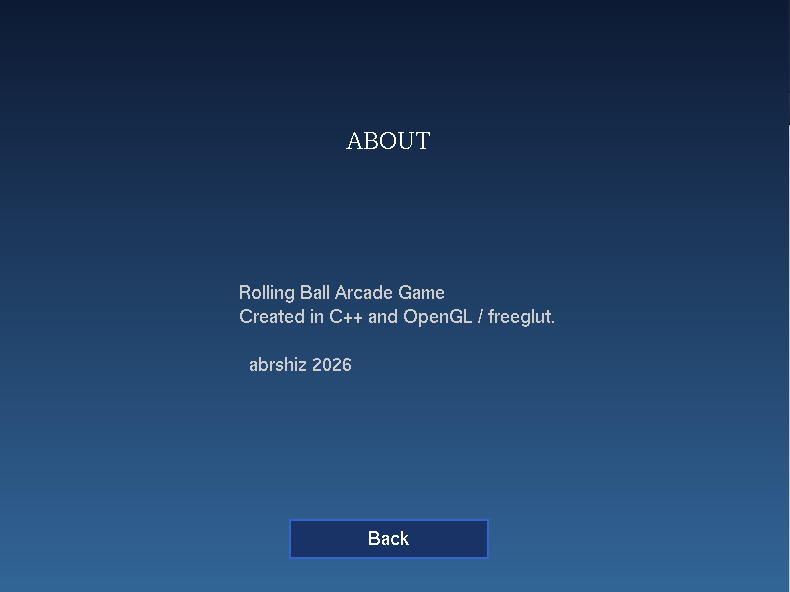

# Rolling Ball (Hot Air Balloon Style)

A 2D arcade-style game built with C++ and OpenGL/GLUT. Experience smooth physics, fluid animations, and classic hot air balloon-style navigation mechanics. 

## 📸 Screenshots

Here is a glimpse of the game in action!

### Opening Game Interface


### Game Dashboard


### Game Playing


### Game Rules


### About


### Game Over


## 🛠 Prerequisites

To compile and run this game, you will need:
- C++ Compiler (GCC/G++)
- OpenGL and FreeGLUT library

### Linux (Debian/Ubuntu)
```bash
sudo apt-get update
sudo apt-get install build-essential freeglut3-dev
```

## 🚀 How to Run

1. Open a terminal in the root directory of the project.
2. Compile the game using the included Makefile:
```bash
make
```
3. Run the compiled executable:
```bash
./RollingBall
```

## 🎮 Features
- Interactive UI and Menu System
- Smooth OpenGL Graphics and Rendering
- Physics-based mechanics and responsive controls
- Persistent High Score system

Enjoy!